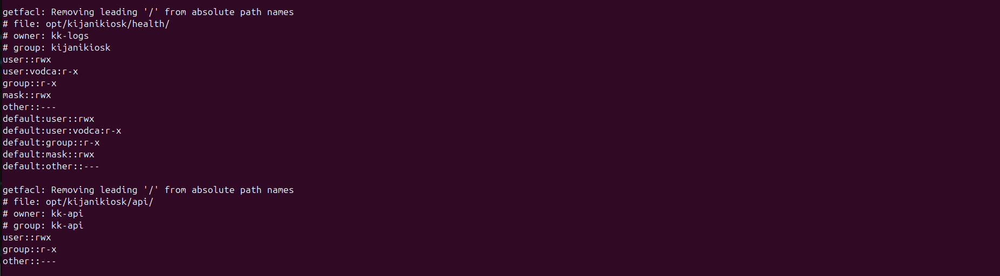
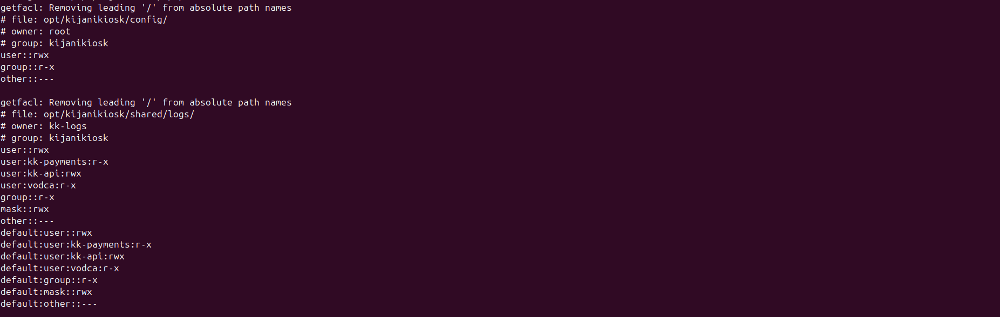

# KijaniKiosk Access Model Final

## Purpose
This document defines the final least-privilege access model for the KijaniKiosk production server foundation. It extends the Tuesday access-control design and adds the Friday requirements for the health directory and the logrotate interaction.

The objective is to ensure that each service can read and write only what it needs, while shared operational resources remain controlled and auditable.

## Identities

### Service accounts
The platform uses three dedicated system service accounts:

- `kk-api` — API service
- `kk-payments` — payments service
- `kk-logs` — log aggregation service

All three are non-interactive system accounts with no normal login shell. This prevents direct shell access while still allowing controlled service execution.

### Shared group
The shared operational group is:

- `kijanikiosk`

This group is used where multiple trusted identities need limited shared access to platform resources.

### Human operator
The regular operator user on this VM is:

- `vodca`

This user has narrow operational read access where needed for troubleshooting and verification, but does not own service resources.

## Directory ownership model

### `/opt/kijanikiosk/api`
- Owner: `kk-api`
- Group: `kk-api`
- Mode: `750`

This directory contains API application files and should only be managed by the API service identity.

### `/opt/kijanikiosk/payments`
- Owner: `kk-payments`
- Group: `kk-payments`
- Mode: `750`

This directory contains the payments application files and is isolated to the payments identity.

### `/opt/kijanikiosk/config`
- Owner: `root`
- Group: `kijanikiosk`
- Directory mode: `750`
- File mode: `640`

This directory stores configuration and secret material. It must not be world-readable or world-traversable. Group-based access allows only approved service identities and the operator to read what is necessary.

### `/opt/kijanikiosk/shared/logs`
- Owner: `kk-logs`
- Group: `kijanikiosk`
- Directory mode: `750`
- Additional ACLs applied

This directory is the main shared-access location and uses ACLs because standard owner/group/other permissions are not expressive enough for the required access pattern.

### `/opt/kijanikiosk/health`
- Owner: `kk-logs`
- Group: `kijanikiosk`
- Directory mode: `750`

This directory stores the structured provisioning health artifact added on Friday. It is readable to the intended operational identities without exposing it to all users.

## ACL model for shared logs
The shared logs directory requires more than one non-owner identity to access it in different ways:

- `kk-logs` owns the directory and has full control
- `kk-api` needs write access so it can create and append log data
- `kk-payments` needs read access for correlation and audit use
- `vodca` needs read access for operational troubleshooting
- `other` has no access

Default ACLs are also set on the directory so that new files created inside it inherit the intended access model automatically.

## Logrotate interaction
This is the most important integration point in the final access model.

When logrotate rotates a file in the shared logs directory, it creates a new file. The `create` directive controls the base owner and mode, but it does not recreate the full ACL model by itself. That means the directory’s default ACLs must already be correct or the access pattern will break after rotation.

The final design therefore relies on both:
- secure file creation settings in logrotate
- correct default ACLs on `/opt/kijanikiosk/shared/logs`

This ensures that post-rotation log files remain usable by the correct services without manual intervention.

## Health directory access model
The Friday project introduced `/opt/kijanikiosk/health`, which was not part of the Tuesday model.

The provisioning script writes `last-provision.json`, then adjusts ownership and permissions so the result is readable by the intended operational identities. The file is not world-readable. This allows monitoring and troubleshooting access without weakening the security posture of the server.

## Verification expectations
The access model is considered correct only if:

- the service accounts exist and retain their intended roles
- `kk-api` can read required configuration
- `kk-api` can write to `/opt/kijanikiosk/shared/logs`
- `kk-payments` can read shared logs
- the health artifact is readable by the intended operator identity
- access still works after forced logrotate

## Evidence

